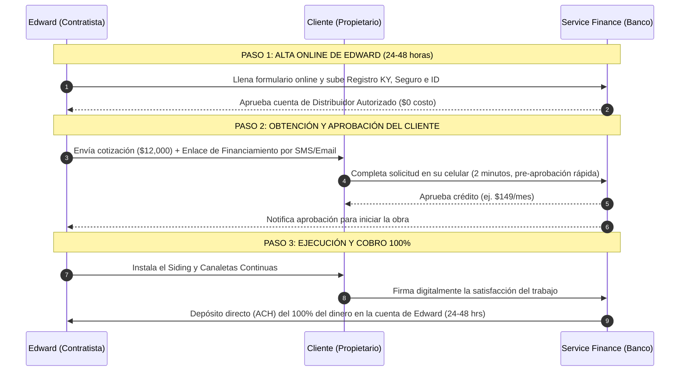

# Guía de Financiamiento para Clientes de Edward Siding & Gutter
### (Consumer Financing / Point-of-Sale Lending)

---

## 📌 Objetivo Único

Permitir que los **clientes (propietarios de vivienda)** en Louisville, KY y alrededores puedan financiar sus proyectos de **siding, canaletas continuas, techos y remodelación exterior** en cuotas mensuales cómodas (ej. $99 - $199/mes), mientras que **Edward Siding & Gutter recibe el 100% del pago por adelantado** en su cuenta bancaria.

---

## 1. Análisis de Service Finance Company (SFC - Una empresa de Truist Bank)

**Service Finance Company** es una de las financieras para clientes de construcción más reconocidas en EE.UU. (usada por empresas líderes de la industria como *Barba Construction*).

### Ventajas de Service Finance Company para Edward:
* **$0 Costo de Inscripción:** No cobran tarifa por dar de alta a Edward Siding como distribuidor/contratista autorizado.
* **Sin Volumen Mínimo:** No exigen un número mínimo de proyectos financiados al año.
* **Respaldado por Truist Bank:** Opciones de préstamos estables, tasas competitivas y financiamiento de hasta **$100,000** por cliente.
* **Planes Promocionales:** Opciones de *"0% de Interés si se paga en 12 meses"* o *"Cuotas reducidas a 60, 84 o 120 meses"*.
* **Cero Riesgo de Impago para Edward:** Si el cliente se retrasa en sus pagos mensuales, el banco (Truist) asume el riesgo. Edward ya cobró el 100% de su trabajo.

---

## 2. ¿Es un Proceso Online y Qué se Necesita para Obtenerlo?

### 🌐 ¡Sí, es 100% Online!
Tanto la inscripción de Edward como la solicitud que realiza el cliente se hacen completamente por internet a través del teléfono celular, tablet o computadora.

---

### 📄 Requisitos para Dar de Alta a Edward Siding & Gutter (Checklist)

Para registrar la empresa de Edward en **Service Finance Company** (o plataformas similares como Hearth / Wisetack), se requieren los siguientes documentos en digital (PDF o foto):

1. **Registro Legal de la Empresa:** 
   - Certificado de la Secretaría de Estado de Kentucky (*Kentucky Secretary of State Certificate of Good Standing* - el mismo documento que Edward ya posee).
   - Formulario **W-9** con el Tax ID / EIN de Edward Siding & Gutter.
2. **Identificación Oficial:**
   - Copia de la Licencia de Conducir o ID estatal de Edward Gonzalez.
3. **Seguro del Negocio (General Liability Insurance):**
   - Certificado de Seguro comercial activo a nombre de la empresa (*Certificate of Insurance - COI*).
4. **Datos Bancarios para Recibir Pagos (Direct Deposit / ACH):**
   - Cheque anulado (*Voided Check*) o carta oficial del banco indicando el número de cuenta y ruta a nombre de Edward Siding & Gutter.
5. **Información Operativa Básica:**
   - Estimación de ventas anuales y dirección del sitio web o página de Facebook de la empresa.

---

## 3. ¿Cómo Funciona el Proceso Paso a Paso? (El Flujo de Trabajo)

---

## 4. Comparativa: Service Finance vs. Otras Alternativas Online

| Característica | **Service Finance Company (SFC)** | **Hearth** | **Wisetack** |
| :--- | :--- | :--- | :--- |
| **Respaldado Por** | Truist Bank | Mercado de 12+ Prestamistas | Prestamistas Directos POS |
| **Costo de Registro para Edward** | **$0 / Gratis** | Suscripción (~$1,799/año) | **$0 / Gratis** |
| **Comisión por Proyecto** | Varía según promoción elegida | $0 en la mayoría de planes | ~3.9% por transacción |
| **Límite de Financiamiento** | Hasta $100,000 | Hasta $250,000 | Hasta $25,000 |
| **Ideal Para** | Contratistas establecidos (como Barba Construction) | Negocios con alto volumen que quieren cotizador integrado | Activar de inmediato sin cuotas fijas |

---

## 📋 Pasos para Comenzar Hoy Mismo

1. **Ingresar a la Plataforma de Registro Online:**
   - Entrar al portal de contratistas de **Service Finance Company** ([svcfin.com/BusinessSignup](https://www.svcfin.com/BusinessSignup)) en la sección *"Business Sign Up"*.
2. **Subir la Documentación de Edward:**
   - Adjuntar el Certificado de Kentucky (*Good Standing*), el COI (Seguro) y la cuenta bancaria.
3. **Recibir Capacitación Corta:**
   - Un representante de Service Finance agendará una llamada de 15 minutos para enseñarle a Edward cómo enviar los enlaces de financiamiento desde la App Móvil.
4. **Comenzar a Cotizar con Pagos Mensuales:**
   - Incluir la opción en todas las cotizaciones de siding y canaletas en Louisville: *"Pregunta por nuestras opciones de financiamiento desde $99/mes"*.

---
*Documento preparado exclusivamente para Edward Siding & Gutter - Louisville, KY.*
